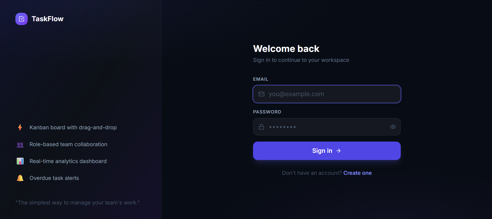
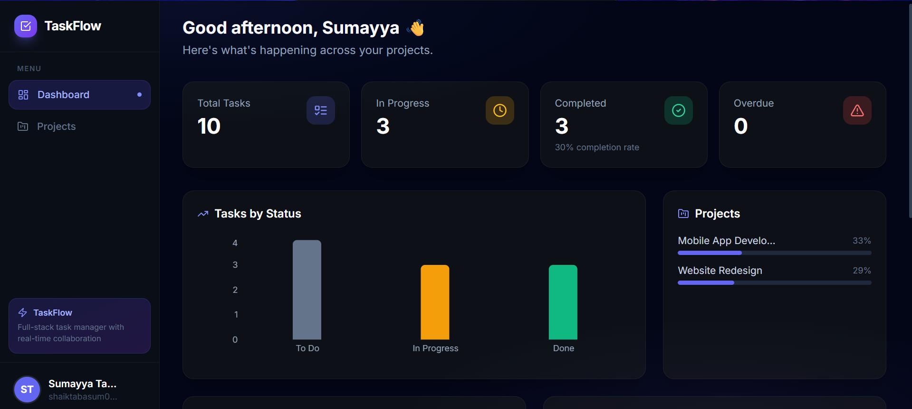
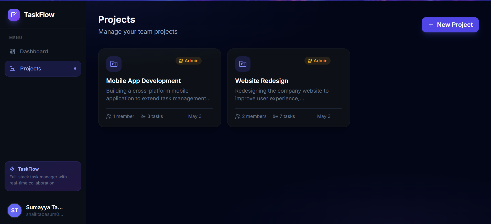
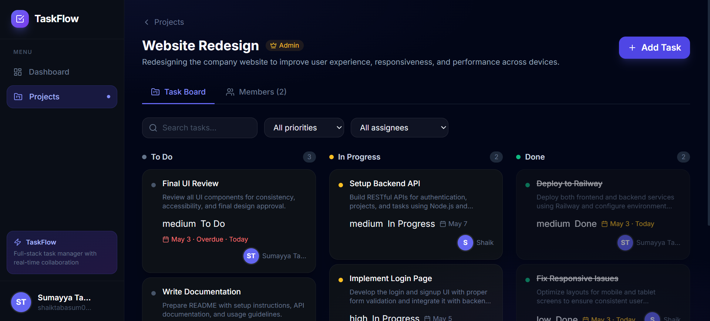

# 🚀 TaskFlow — Team Task Manager

A full-stack collaborative task management platform designed to help teams efficiently organize, track, and manage their work using a modern Kanban-style workflow.

---

## 🌐 Live Links

- 🔗 Frontend: https://diplomatic-love-production.up.railway.app
- 🔗 Backend API: https://taskflow-production-4aa5.up.railway.app/api
- 📂 Repository: https://github.com/sumayyatabasum/taskflow
  
---

## 📌 Overview

TaskFlow is a scalable full-stack web application that enables teams to:

- Manage projects collaboratively
- Assign and track tasks
- Visualize workflow using a Kanban board
- Monitor productivity with analytics dashboards

This project demonstrates real-world backend architecture, authentication, role-based access, and database design.

---

## ✨ Key Features

### 🔐 Authentication & Security

- JWT-based authentication system
- Secure password hashing using bcrypt
- Protected routes with middleware

### 📁 Project Management

- Create and manage multiple projects
- Add/remove team members
- Role-based permissions (Admin / Member)

### ✅ Task Management

- Kanban board (To Do → In Progress → Done)
- Task priorities and due dates
- Assign tasks to users

### 📊 Dashboard & Analytics

- Task status distribution
- Overdue task tracking
- User-wise task insights
- Project progress monitoring

### 🔑 Role-Based Access Control (RBAC)

- Admins: Full control
- Members: Limited to assigned tasks

---

## 📸 Screenshots

### 🔐 Login Page


### 📊 Dashboard


### 📁 Projects


### ✅ Tasks


---

## 🧱 Tech Stack

| Layer      | Technology                           |
| ---------- | ------------------------------------ |
| Frontend   | Next.js 14, TypeScript, Tailwind CSS |
| Backend    | Node.js, Express.js                  |
| Database   | PostgreSQL (Supabase / Railway)      |
| Auth       | JWT, bcrypt                          |
| Charts     | Recharts                             |
| Deployment | Railway                              |

---

## 🏗️ Architecture

- Backend follows **MVC architecture**
- RESTful API design
- PostgreSQL with relational schema
- Frontend uses **Next.js App Router**
- Axios for API communication

---

## ⚙️ Local Setup

### 📌 Prerequisites

- Node.js (v18+)
- PostgreSQL OR Supabase account

---

### 1️⃣ Clone Repository

```bash
git clone https://github.com/sumayyatabasum/taskflow.git
cd taskflow
```

### 2️⃣ Database Setup

- Run schema:

```bash
psql -U postgres -d taskflow -f backend/src/config/schema.sql
```

OR use Supabase SQL Editor.

### 3️⃣ Backend Setup

```bash
cd backend
npm install
cp .env.example .env
```

- Edit .env:

```bash
PORT=5000
DATABASE_URL=your_database_url
JWT_SECRET=your_secret_key
JWT_EXPIRES_IN=7d
FRONTEND_URL=http://localhost:3000
NODE_ENV=development
```

- Run backend:

```bash
npm run dev
```

### 4️⃣ Frontend Setup

```bash
cd frontend
npm install
cp .env.example .env.local
```

- Edit:
  NEXT_PUBLIC_API_URL=http://localhost:5000/api

- Run frontend:

```bash
npm run dev
```

---

## 📡 API Overview

### 🔐 Auth

- POST /api/auth/signup
- POST /api/auth/login
- GET /api/auth/me

### 📁 Projects

- GET /api/projects
- POST /api/projects
- DELETE /api/projects/:id

### ✅ Tasks

- GET /api/projects/:id/tasks
- POST /api/projects/:id/tasks
- PATCH /api/projects/:id/tasks/:taskId

### 📊 Dashboard

- GET /api/dashboard

---

## 📂 Project Structure

```bash
taskflow/
├── backend/
│   ├── src/
│   │   ├── config/
│   │   │   ├── db.js          # PostgreSQL connection pool
│   │   │   └── schema.sql     # Database schema
│   │   ├── controllers/
│   │   │   ├── authController.js
│   │   │   ├── projectController.js
│   │   │   ├── taskController.js
│   │   │   └── dashboardController.js
│   │   ├── middleware/
│   │   │   ├── auth.js        # JWT + RBAC middleware
│   │   │   └── errorHandler.js
│   │   ├── routes/
│   │   │   └── index.js       # All API routes
│   │   └── index.js           # Express app entry point
│   ├── .env.example
│   ├── railway.toml
│   └── package.json
│
└── frontend/
    ├── src/
    │   ├── app/
    │   │   ├── page.tsx           # Root redirect
    │   │   ├── login/page.tsx
    │   │   ├── signup/page.tsx
    │   │   ├── dashboard/page.tsx
    │   │   └── projects/
    │   │       ├── page.tsx
    │   │       └── [projectId]/page.tsx
    │   ├── components/
    │   │   ├── AppLayout.tsx      # Auth guard + layout
    │   │   ├── Sidebar.tsx        # Navigation
    │   │   ├── ui/Modal.tsx
    │   │   └── tasks/
    │   │       ├── TaskCard.tsx
    │   │       └── TaskForm.tsx
    │   ├── hooks/useAuth.tsx      # Auth context
    │   ├── lib/api.ts             # Axios instance
    │   └── types/index.ts         # TypeScript types
    ├── .env.example
    ├── railway.toml
    └── package.json
```

---

## 🧠 Design Decisions

- MVC pattern for clean backend structure
- Parameterized queries → prevent SQL injection
- Transactions for atomic operations
- RBAC middleware for access control
- Optimistic UI for better UX

---

## 🚀 Deployment

### Deployed using Railway:

- Backend service
- Frontend service
- PostgreSQL database

---

## 📈 Future Improvements

- Real-time updates using WebSockets
- Drag-and-drop Kanban
- Notifications system
- File attachments for tasks

---

## ⭐ Conclusion

### TaskFlow demonstrates full-stack development skills including:

- API design
- Authentication systems
- Database modeling
- Frontend architecture
- Deployment

This project is built to simulate a real-world team collaboration tool.

---

## 🤝 Contributing

Contributions are welcome!

1. Fork the repository
2. Create a new branch
3. Make your changes
4. Submit a pull request
   
---
## 👩‍💻 Author

Sumayya Tabasum

- GitHub: https://github.com/sumayyatabasum
- LinkedIn: https://www.linkedin.com/in/shaik-sumayya-68a9582a4/
